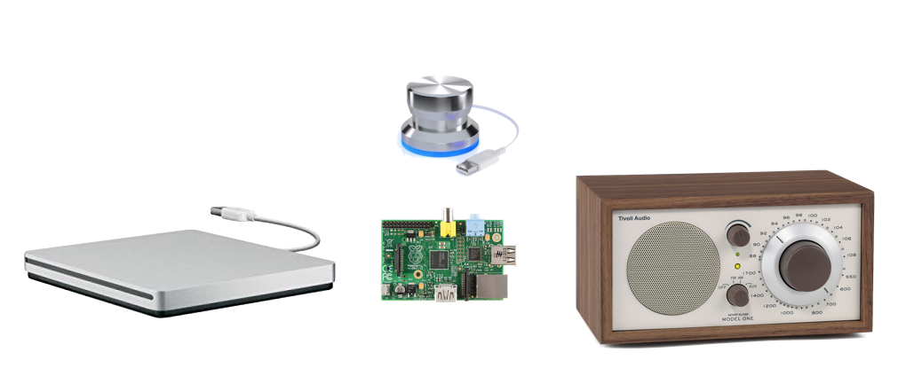
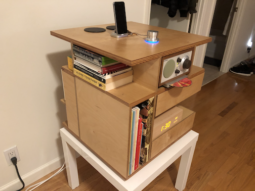

# media-cube-cd-player



This repo holds scripts, notes, and hacks to make my Raspberry Pi play CDs from an [Apple USB SuperDrive](https://www.apple.com/shop/product/MD564LL/A/apple-usb-superdrive), with a [Griffin PowerMate](https://griffintechnology.com/powermate-usb-classic-aluminum) USB knob to control playback.

## Concept

> This is all so I can play CDs with my [Media Cube](https://andrewwestling.com/posts/media-cube).



- (Apple USB SuperDrive is connected to Raspberry Pi USB)
- (Griffin PowerMate is connected to Raspberry Pi USB)
- (Tivoli Audio Model One is connected to Raspberry Pi 3.5mm Audio Out)
- Put CD in Apple USB SuperDrive
- Music starts playing automatically through Raspberry Pi 3.5mm Audio Out
- Use Griffin PowerMate to pause/play (press), change track (press+turn), and eject disc (long press)

## Parts

### SuperDrive Initializer

Apple's USB SuperDrive's firmware has a built-in "lock" on it that requires the host machine to send a "magic" byte sequence to the drive when it's connected in order for it to be recognized and used.

This is detailed by Christian Moser [here](https://christianmoser.me/use-apples-usb-superdrive-with-linux/)

The gist is:

```bash
# Install sg
sudo apt-get install sg3-utils
# Send this byte sequence to the drive using SCSI Generic driver packages
sg_raw /dev/sr0 EA 00 00 00 00 00 01
```

### Audio Playback

- [Mplayer: Play Audio CD Using Linux Command Line](https://www.cyberciti.biz/faq/linux-unix-mplayer-playing-audio-dvd-cd-using-bash-shell/)

### Raspberry Pi Sound Configuration

- [ALSA, `amixer`, and `alsa-utils`](http://blog.scphillips.com/posts/2013/01/sound-configuration-on-raspberry-pi-with-alsa/)
- [Setting Volume for 3.5mm jack](https://www.raspberrypi.org/forums/viewtopic.php?t=14966)

**Volume Commands**
```bash
# Increase volume by 5%
alias volu='sudo amixer set PCM -- $[$(amixer get PCM|grep -o [0-9]*%|sed 's/%//')+5]%'
# Decrease volume by 5%
alias vold='sudo amixer set PCM -- $[$(amixer get PCM|grep -o [0-9]*%|sed 's/%//')-5]%'
```

### PowerMate Drivers

- [bethebunny/powermate](https://github.com/bethebunny/powermate) - Small Python framework for scripting interactions with Griffin PowerMate


### AirPlay


- [Apple Airplay on Raspberry Pi in 7 Easy Steps](https://appcodelabs.com/7-easy-steps-to-apple-airplay-on-raspberry-pi)

**Commands**

```bash
sudo apt-get install autoconf automake avahi-daemon avahi-discover avahi-utils build-essential git libasound2-dev libavahi-client-dev libavahi-glib-dev libconfig-dev libdaemon-dev libpopt-dev libssl-dev libtool xmltoman
git clone https://github.com/mikebrady/shairport-sync.git
cd shairport-sync
autoreconf -i -f
./configure --with-alsa --with-avahi --with-ssl=openssl --with-systemd --with-metadata --with-dbus-interface
make
sudo make install
sudo systemctl enable shairport-sync
sudo vi /usr/local/etc/shairport-sync.conf
# Edit Name to "Media Cube"
# Uncomment and edit "allow_session_interruption" to "yes" to allow people to takeover the speaker
# Uncomment and edit "session_timeout" to like 20, this seems to need to be set in order for allow_session_interruption to work
sudo reboot
```

### Spotify

Headless Spotify for control with `knob` library

[spotifyd install instructions for Raspberry Pi](https://github.com/Spotifyd/spotifyd/wiki/Installing-on-a-Raspberry-Pi)

```bash
# Had to reinstall unzip for some reason
sudo apt-get install unzip

# Grab the repo
cd ~
wget https://github.com/Spotifyd/spotifyd/releases/download/v0.2.5/spotifyd-2019-02-25-armv6.zip # had to use 0.2.5 because the current version is compiled for ARMv7 and my pi is too old to run this architecture and I don't know how to recompile it so meh
unzip spotifyd-2019-02-25-armv6.zip # Now you have ~/spotifyd available

# Create configuration file
sudo nano ~/spotifyd.conf

# Paste in the following and save/exit:
: '
[global]
username = 1283883
password = "(Get Spotify password from 1Password)"
backend = alsa
device = default
mixer = PCM
volume-control = alsa
device_name = "MediaCube"
bitrate = 160
cache_path = cache_directory
volume-normalisation = true
normalisation-pregain = -10
'

# Create systemctl service file
sudo nano /etc/systemd/system/spotifyd.service

# Paste in the following
: '
[Unit]
Description=Spotify Connect daemon for MediaCube
Documentation=https://github.com/Spotifyd/spotifyd
Wants=sound.target
After=sound.target
Wants=network-online.target
After=network-online.target

[Service]
ExecStart=/home/pi/spotifyd --no-daemon --config /home/pi/spotifyd.conf
Restart=always
RestartSec=12

[Install]
WantedBy=default.target
'

# Start the service
sudo systemctl daemon-reload
sudo systemctl enable spotifyd
sudo systemctl start spotifyd

# Connect to MediaCube on Spotify Connect and music should be playing
```

---

## Precedents
- [Bluetooth CD Player with RPi 3](https://www.heinbockel.eu/2016/12/09/bluetooth-cd-player-with-raspberry-pi-3/)
- [Reddit: Project idea: Raspberry Pi + CD Reader >= CD player?](https://www.reddit.com/r/raspberry_pi/comments/35yu0u/project_idea_raspberry_pi_cd_reader_cd_player/)
- [GitHub `ivankrato/raspberry-pi-cdplayer`](https://github.com/ivankrato/raspberry-pi-cdplayer)
- [Raspberry Pi, Jivelite, and Griffin PowerMate](https://forums.slimdevices.com/showthread.php?103051-Raspberry-PI-Jivelite-and-a-Griffin-Powermate)
