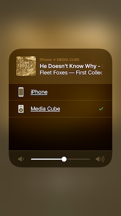

# shairport-sync



- [Apple Airplay on Raspberry Pi in 7 Easy Steps](https://appcodelabs.com/7-easy-steps-to-apple-airplay-on-raspberry-pi)

This was the configuration I used to set up an AirPlay server on Media Cube:

```bash
sudo apt-get install autoconf automake avahi-daemon avahi-discover avahi-utils build-essential git libasound2-dev libavahi-client-dev libavahi-glib-dev libconfig-dev libdaemon-dev libpopt-dev libssl-dev libtool xmltoman
git clone https://github.com/mikebrady/shairport-sync.git
cd shairport-sync
autoreconf -i -f
./configure --with-alsa --with-avahi --with-ssl=openssl --with-systemd --with-metadata --with-dbus-interface
make
sudo make install
sudo systemctl enable shairport-sync
sudo vi /usr/local/etc/shairport-sync.conf
# Edit Name to "Media Cube"
# Uncomment and edit "allow_session_interruption" to "yes" to allow people to takeover the speaker
# Uncomment and edit "session_timeout" to like 20, this seems to need to be set in order for allow_session_interruption to work
sudo reboot
```
